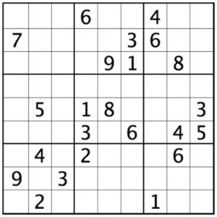

# Sudoku Solver

This is a Python implementation of a sudoku puzzle solver, which relies on the backtracking algorithm. We will be working with a 9x9 square grid containing **81 cells**. The grid itself is subdivided into nine 3x3 blocks. Some of the cells are filled with numbers 1-9 and are called **givens**. Our objective is to complete a partially filled grid.

## *Example:*

## History

The history of Sudoku dates back to 18th century Swiss mathematician Leonhard Euler who wrote about Graeco-Latin Squares in his paper [Recherches sur une neouvelle espece de quarres magiques](https://scholarlycommons.pacific.edu/euler-works/530/), published in 1782.

A modern version of the puzzle made its first appearance in 1979 when it got published by *Dell Puzzles and Word Games* magazine. Howard Garns, a retired american architect, ran it under the name **Number Palace**.

It quickly became widely popular in Japan where it was first publiched in 1984 by *Monthly Nikolist* magazine.

## Sudoku One Rule

- Each of the 1-9 numbers must appear only **once** per **row**

- Each of the 1-9 numbers must appear only **once** per **column**

- Each of the nine blocks must contain **all** of the 1-9 numbers within its squares

## Outcome

